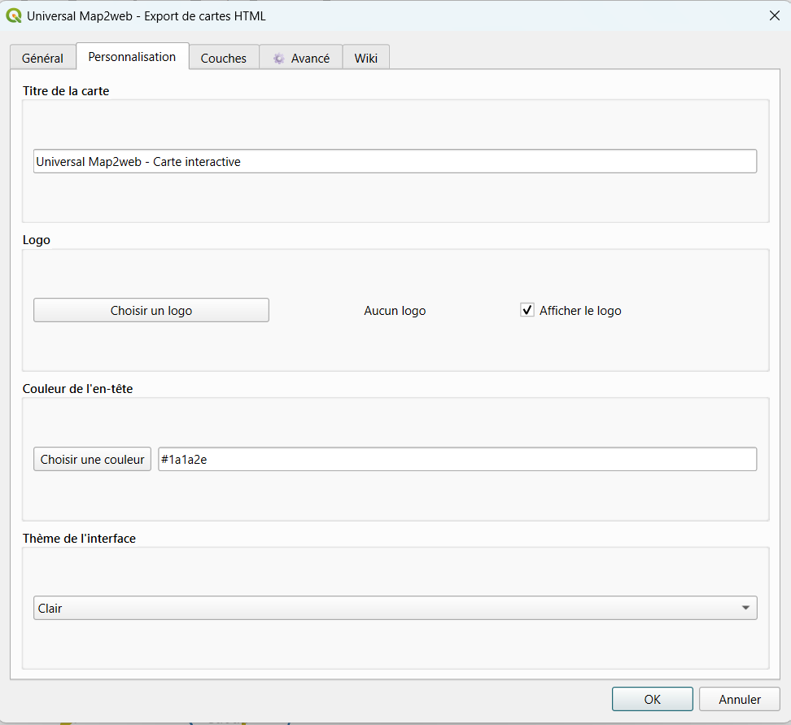
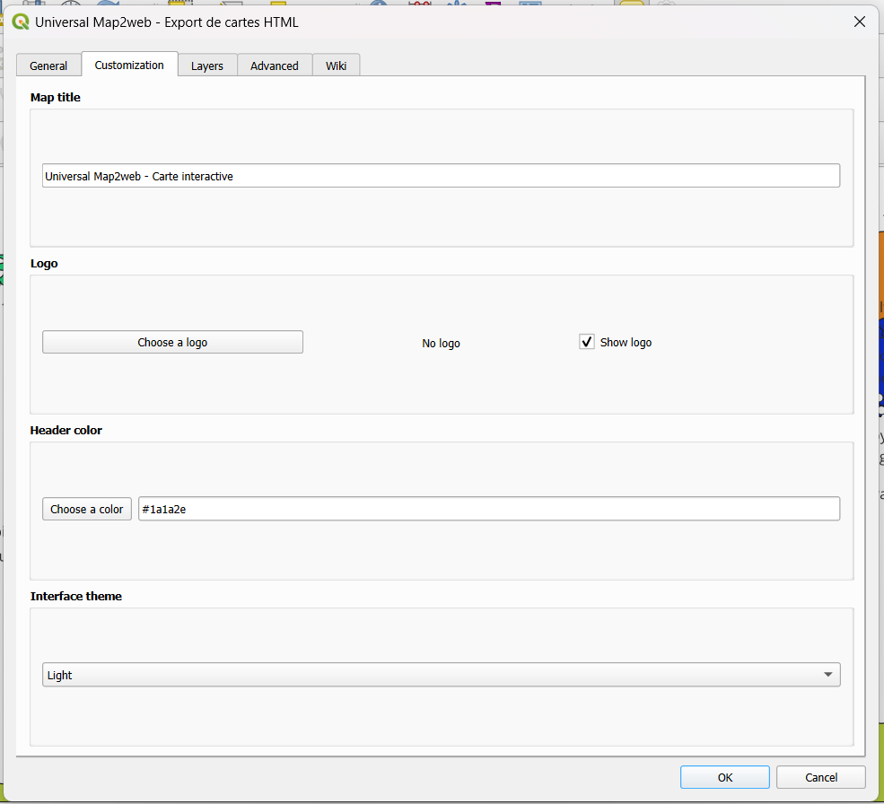
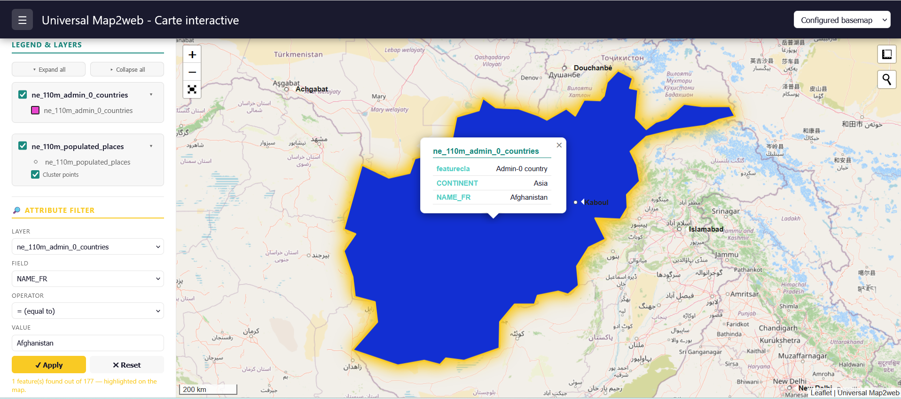

# Universal Map2web

**Export your QGIS layers to interactive web maps with Leaflet!**

## En English

## About

Universal Map2web is a QGIS plugin that exports your vector layers to interactive web maps with **Leaflet**, faithfully preserving **QGIS symbology and styles**.

## Tutorial Video

https://youtu.be/V67q3jCYKow

## Documentation

Le manuel d'utilisation complet est disponible ici :
[Télécharger le manuel Universal Map2web (PDF)](docs/Universal%20map2web%20User%20Manuel.pdf)

## Features

- 1 **QGIS symbology preservation** (colors, widths, opacities, line styles)
- 2 **Support for all renderers**: Single, Categorized, Graduated, Rule-based
- 3 **Automatic QGIS labeling**
- 4 **Customizable popups** per layer
- 5 **Advanced attribute filtering**
- 6 **Colored point clustering**
- 7 **Integrated tools**: Measure, Search, Geolocation, Fullscreen, Scale bar, MiniMap, Print
- 8 **Interface themes**: Light, Dark, Professional, Colorful
- 9 **Customizable logo and header color**
- 10 **Built-in local server** (avoids CORS issues)
- 11 **Export to PNG, PDF and CSV**
- 12 **Multi-language support** (English/French)

## Interface

## Customization Tab

## Exported Web Interface

## Installation

### From the official QGIS repository

1. Open QGIS
2. Go to `Plugins` → `Manage and Install Plugins...`
3. Search for `Universal Map2web`
4. Click `Install`

### From GitHub

1. Download the `universal_map2web` folder
2. Copy it to the QGIS plugins folder:
   - Windows: `C:\Users\YourName\AppData\Roaming\QGIS\QGIS3\profiles\default\python\plugins\`
   - Linux: `~/.local/share/QGIS/QGIS3/profiles/default/python/plugins/`
   - Mac: `~/.local/share/QGIS/QGIS3/profiles/default/python/plugins/`
3. Activate the plugin in QGIS

## Usage

1. Click the `Universal Map2web` icon in the toolbar
2. Select the layers to export
3. Customize options (title, logo, theme, language, etc.)
4. Click `OK`
5. The map opens automatically in your browser

## Requirements

- QGIS 3.16 or higher
- Modern web browser (Chrome, Firefox, Edge, Safari)

## License

This project is licensed under the GNU GPL v2. See the [LICENSE](LICENSE) file for details.

## 👤 Author

**Jean-baptiste Bazikité KIBORA**

- Email : jeanbaptiste.kibora@tic.gov.bf
- GitHub : [@geomatic-web](https://github.com/geomatic-web)

## Acknowledgments

- [QGIS](https://qgis.org) - The best open-source GIS
- [Leaflet](https://leafletjs.com) - The JavaScript mapping library
- [qgis2web](https://github.com/tomchadwin/qgis2web) - Inspiration source

## 🇫🇷 Français

## À propos

Universal Map2web est une extension QGIS qui exporte vos couches vectorielles en cartes web interactives avec **Leaflet**, en préservant **fidèlement la symbologie et les styles de votre projet QGIS**.

## Tutorial video

https://youtu.be/V67q3jCYKow

## Fonctionnalités

- 1 **Préservation de la symbologie QGIS** (couleurs, épaisseurs, opacités, styles de ligne)
- 2 **Support de tous les renderers** : Simple, Catégorisé, Gradué, Règle
- 3 **Étiquetage QGIS** (labeling) automatique
- 4 **Popups personnalisables** par couche
- 5 **Filtre avancé par attribut**
- 6 **Cluster de points** colorés
- 7 **Outils intégrés** : Mesure, Recherche, Géolocalisation, Plein écran, Échelle, MiniMap, Impression
- 8 **Thèmes d'interface** : Clair, Sombre, Professionnel, Coloré
- 9 **Logo et couleur d'en-tête personnalisables**
- 10 **Serveur local intégré** (évite les problèmes CORS)
- 11 **Export PNG, PDF et CSV**

## Interface

## Onglet personnalisation

## Interface web exportée

## Installation

### Depuis le dépôt officiel QGIS

1. Ouvrez QGIS
2. Allez dans `Extensions` → `Gérer et installer les extensions...`
3. Recherchez `Universal Map2web`
4. Cliquez sur `Installer`

### Depuis GitHub

1. Téléchargez le dossier `universal_map2web`
2. Copiez-le dans le dossier des plugins QGIS :
   - Windows : `C:\Users\VotreNom\AppData\Roaming\QGIS\QGIS3\profiles\default\python\plugins\`
   - Linux : `~/.local/share/QGIS/QGIS3/profiles/default/python/plugins/`
   - Mac : `~/.local/share/QGIS/QGIS3/profiles/default/python/plugins/`
3. Activez l'extension dans QGIS

## Utilisation

1. Cliquez sur l'icône `Universal Map2web` dans la barre d'outils
2. Sélectionnez les couches à exporter
3. Personnalisez les options (titre, logo, thème, etc.)
4. Cliquez sur `OK`
5. La carte s'ouvre automatiquement dans votre navigateur

## Dépendances

- QGIS 3.40 ou supérieur
- Navigateur web moderne (Chrome, Firefox, Edge, Safari)

## Licence

Ce projet est sous licence GNU GPL v2. Voir le fichier [LICENSE](LICENSE) pour plus de détails.

## 👤 Auteur

**Jean-baptiste Bazikité KIBORA**

- Email : jeanbaptiste.kibora@tic.gov.bf
- GitHub : [@geomatic-web](https://github.com/geomatic-web)

## Remerciements

- [QGIS](https://qgis.org) - Le meilleur SIG open source
- [Leaflet](https://leafletjs.com) - La bibliothèque cartographique JavaScript
- [qgis2web](https://github.com/tomchadwin/qgis2web) - Source d'inspiration
