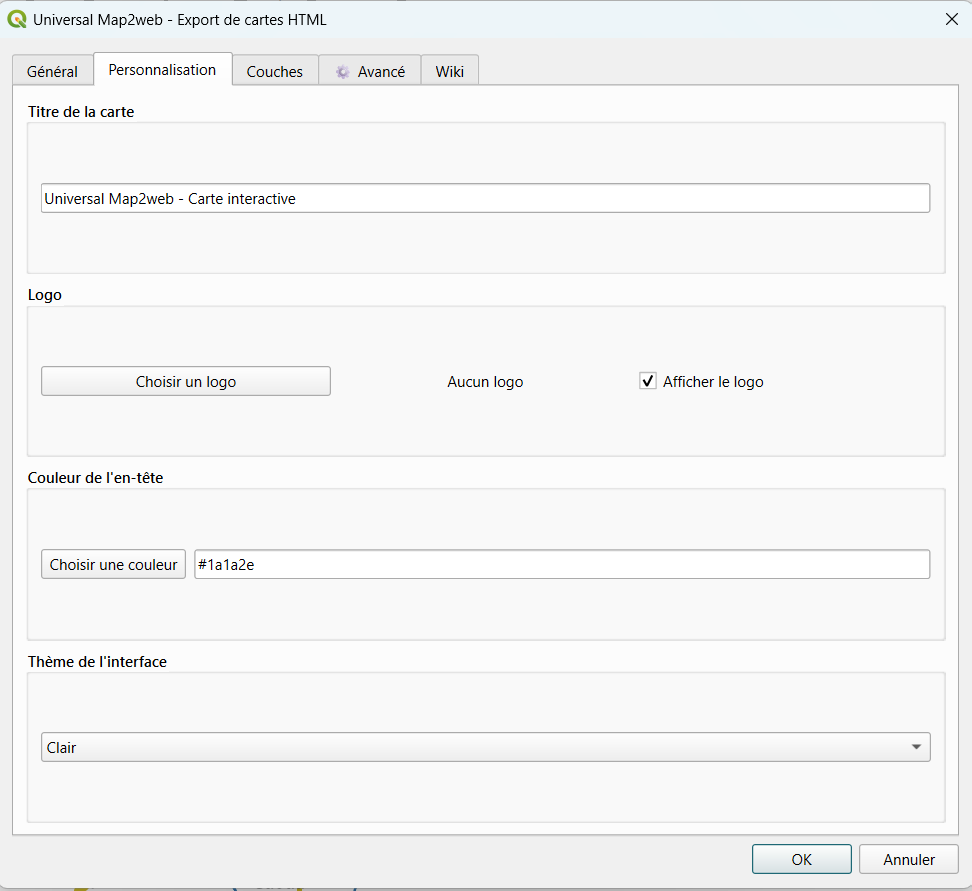
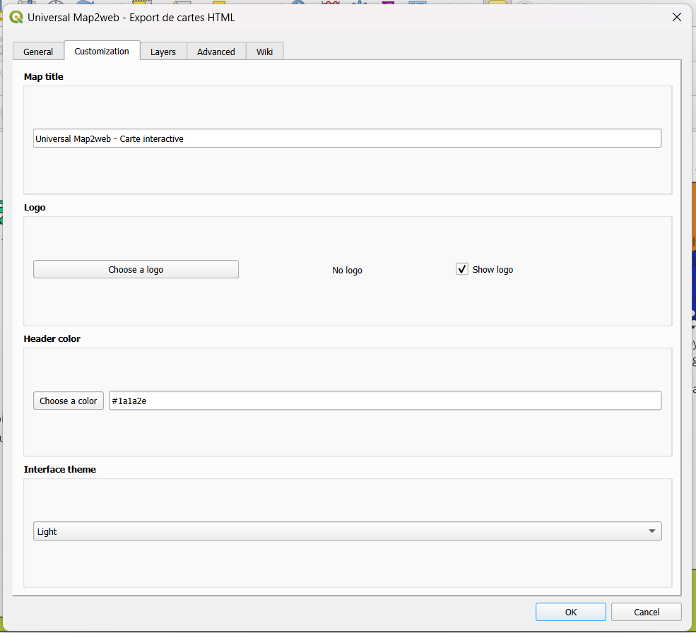
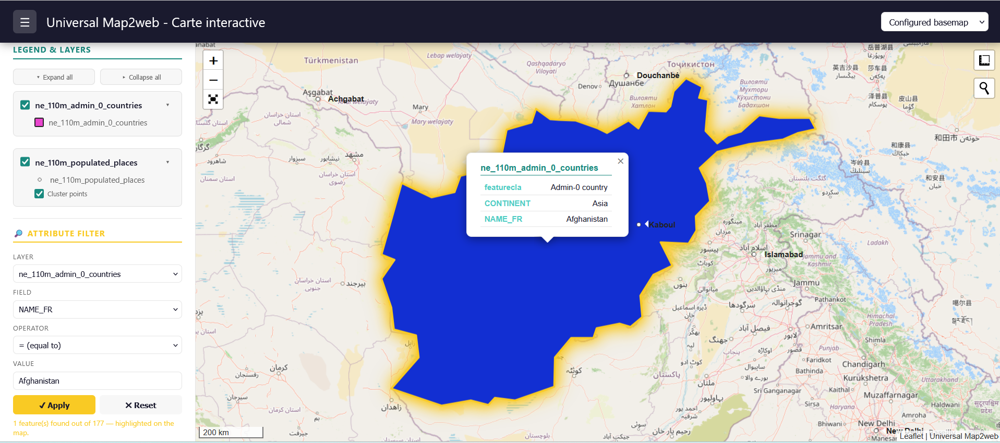

# Universal Map2web

**Export your QGIS layers to interactive web maps with Leaflet!**

[](https://github.com/geomatic-web/universal-map2web)
[](https://github.com/geomatic-web/universal_map2web)
[](https://github.com/geomatic-web/universal_map2web)

## En English

## About

Universal Map2web is a QGIS plugin that exports your vector layers to interactive web maps with **Leaflet**, faithfully preserving **QGIS symbology and styles**.

## Tutorial Video

https://www.youtube.com/watch?v=6DIGVI7V55E

## Documentation

The complete user manual is available here:
[Download the Universal Map2web User Manual (PDF)](docs/Universal%20map2web%20User%20Manuel.pdf)

## Features

- 1 **QGIS symbology preservation** (colors, widths, opacities, line styles)
- 2 **Support for all renderers**: Single, Categorized, Graduated, Rule-based
- 3 **Automatic QGIS labeling**
- 4 **Customizable popups** per layer
- 5 **Advanced attribute filtering**
- 6 **Colored point clustering**
- 7 **Integrated tools**: Measure, Search, Geolocation, Fullscreen, Scale bar, MiniMap, Print
- 8 **Interface themes**: Light, Dark, Professional, Colorful
- 9 **Customizable logo and header color**
- 10 **Built-in local server** (avoids CORS issues)
- 11 **Export to PNG, PDF and CSV**
- 12 **Multi-language support** (English/French)
- 13 **Dynamic PostgreSQL/PostGIS mode**: layers already connected to a PostGIS database in QGIS can stay live on the exported web map instead of being frozen into a static GeoJSON file
- 14 **Attribute table** for every vector layer: floating window with sorting, per-column filters, global search, map highlighting and CSV export
- 15 **Zoom to layer** button next to each layer
- 16 **Live WFS (vector) and WMS (raster) layers** loaded directly from GeoServer or any OGC server (CORS required, see below)

## Dynamic PostgreSQL mode

For layers already connected to PostgreSQL/PostGIS in QGIS, you can enable **"Load PostGIS layers dynamically from PostgreSQL (instead of a static export)"** in the export dialog. When enabled:

- The plugin reuses the connection already configured in QGIS (no credentials re-entered in the plugin)
- A single `get_data.php` endpoint plus a protected `db_config.php` are generated in the export folder
- A random API key is generated for each export to restrict access to the endpoint
- `.htaccess` blocks direct access to `db_config.php`
- The web map queries the database live (with optional bounding-box filtering), so it always reflects the current data instead of a snapshot taken at export time
- Layers not connected to PostgreSQL, or when this option is left unchecked, are still exported as static GeoJSON as before

**Requirement**: a PHP-capable web server with the `pdo_pgsql` extension is needed to host the exported site in this mode (a plain static file host is not enough).

## Attribute table

Every vector layer (shapefile/GeoJSON, WFS or PostgreSQL/PostGIS) has a small **table icon** in front of its name in the legend of the exported map. Click it to open the attribute table in a floating window:

- Draggable and resizable window; several tables can be open at the same time
- Click a column header to **sort**; type under a header to **filter** that column; use the global search box to search all columns
- **Hover a row** to highlight the feature on the map; hold **Ctrl** while hovering (or click the row) to zoom to it
- **Export to CSV** of the rows currently displayed (after filtering and sorting), `;`-separated, UTF-8 with BOM so Excel opens it correctly
- Paged display (100 rows per page) so large layers stay fast

A **magnifier icon** next to the table icon zooms the map to the extent of the layer.

> The table shows the features actually loaded in the page. In dynamic PostgreSQL mode with bounding-box filtering, only the features of the loaded area are listed.

## Live WFS / WMS layers

- **WFS (vector)**: a vector layer that is connected to a WFS service in QGIS is detected automatically. No GeoJSON file is written: the exported page requests the features (`GetFeature`, `application/json`) directly from the WFS server each time it loads. No PHP backend is needed. The layer behaves like any other vector layer (symbology, popups, filter, attribute table).
- **WMS (raster)**: layers connected to a WMS service appear in a separate **WMS layers** list in the export dialog. They are displayed as tiles requested live from the server. Clicking the map queries the server (`GetFeatureInfo`) and shows the result in a popup.

The connection settings are read from the layer already configured in QGIS: nothing has to be typed again in the plugin.

**Requirements for live OGC layers**

- The GeoServer (or other OGC server) must be reachable from the **visitor's browser**, not only from your computer
- If the exported map is served over `https://`, the OGC server must also use `https://` (browsers block mixed content)
- The server must allow **CORS** (see below)
- For WFS, the `application/json` output format must be available (enabled by default in GeoServer)

## Enabling CORS on GeoServer (WFS and WMS)

The exported map is opened from another *origin* than your GeoServer (your website, or `http://localhost:PORT` when using the built-in local server). The browser only allows the page to read GeoServer responses if GeoServer sends the `Access-Control-Allow-Origin` header. The built-in local server does not remove this requirement for remote WFS/WMS services.

| Service | Without CORS |
|---|---|
| **WFS** | The layer cannot be loaded: the legend shows *"Could not load this layer (server unreachable or blocked by CORS)"* |
| **WMS** | Tiles are still displayed (they are loaded as images), but click-to-query (`GetFeatureInfo` as JSON) is blocked and the plugin falls back to an HTML frame |

**Option A – GeoServer Web Administration (recent versions)**
Recent GeoServer versions include a CORS setting in the Web Administration interface (see *Enable CORS* in the GeoServer documentation, section *Container Considerations*). Enable it, then **restart GeoServer**.

**Option B – `web.xml` (all versions)**
Edit `webapps/geoserver/WEB-INF/web.xml` and uncomment (or add) the CORS `<filter>` **and** its `<filter-mapping>`, then restart.

*Standalone / binary installer (Jetty):*

```xml
<filter>
  <filter-name>cross-origin</filter-name>
  <filter-class>org.eclipse.jetty.servlets.CrossOriginFilter</filter-class>
</filter>
<filter-mapping>
  <filter-name>cross-origin</filter-name>
  <url-pattern>/*</url-pattern>
</filter-mapping>
```

*WAR deployed in Tomcat:*

```xml
<filter>
  <filter-name>CorsFilter</filter-name>
  <filter-class>org.apache.catalina.filters.CorsFilter</filter-class>
  <init-param>
    <param-name>cors.allowed.origins</param-name>
    <param-value>*</param-value>
  </init-param>
  <init-param>
    <param-name>cors.allowed.methods</param-name>
    <param-value>GET,POST,HEAD,OPTIONS</param-value>
  </init-param>
  <init-param>
    <param-name>cors.allowed.headers</param-name>
    <param-value>Content-Type,X-Requested-With,accept,Origin,Access-Control-Request-Method,Access-Control-Request-Headers</param-value>
  </init-param>
</filter>
<filter-mapping>
  <filter-name>CorsFilter</filter-name>
  <url-pattern>/*</url-pattern>
</filter-mapping>
```

**Important**

- Use **one** method only. Enabling CORS in the interface *and* in `web.xml` (or also in a reverse proxy such as Apache/Nginx) sends duplicate `Access-Control-Allow-Origin` values, which makes browsers reject the response
- `*` allows any website. In production, replace it with your own site(s), e.g. `https://maps.example.org`
- Check it with: `curl -I -H "Origin: https://maps.example.org" "https://your-geoserver/geoserver/ows?service=WFS&request=GetCapabilities"` and look for `Access-Control-Allow-Origin` in the response headers

## Interface



## Customization Tab



## Exported Web Interface



## Installation

### From the official QGIS repository

1. Open QGIS
2. Go to `Plugins` → `Manage and Install Plugins...`
3. Search for `Universal Map2web`
4. Click `Install`

### From GitHub

1. Download the `universal_map2web` folder
2. Copy it to the QGIS plugins folder:
   - Windows: `C:\Users\YourName\AppData\Roaming\QGIS\QGIS3\profiles\default\python\plugins\`
   - Linux: `~/.local/share/QGIS/QGIS3/profiles/default/python/plugins/`
   - Mac: `~/.local/share/QGIS/QGIS3/profiles/default/python/plugins/`
3. Activate the plugin in QGIS

## Usage

1. Click the `Universal Map2web` icon in the toolbar
2. Select the layers to export
3. Customize options (title, logo, theme, language, etc.)
4. Click `OK`
5. The map opens automatically in your browser

## Requirements

- QGIS 3.16 or higher
- Modern web browser (Chrome, Firefox, Edge, Safari)

## License

This project is licensed under the GNU GPL v2. See the [LICENSE](LICENSE) file for details.

## 👤 Author

**Jean-baptiste Bazikité KIBORA**

- Email : jeanbaptiste.kibora@tic.gov.bf
- GitHub : [@geomatic-web](https://github.com/geomatic-web)

## Acknowledgments

- [QGIS](https://qgis.org) - The best open-source GIS
- [Leaflet](https://leafletjs.com) - The JavaScript mapping library
- [qgis2web](https://github.com/tomchadwin/qgis2web) - Inspiration source

## 🇫🇷 Français

## À propos

Universal Map2web est une extension QGIS qui exporte vos couches vectorielles en cartes web interactives avec **Leaflet**, en préservant **fidèlement la symbologie et les styles de votre projet QGIS**.

## Tutorial video

[https://youtu.be/V67q3jCYKow](https://www.youtube.com/watch?v=6DIGVI7V55E)

La documentation complète disponible ici:
[Télécharger la version pdf (PDF)](docs/Universal%20map2web%20User%20Manuel.pdf)

## Fonctionnalités

- 1 **Préservation de la symbologie QGIS** (couleurs, épaisseurs, opacités, styles de ligne)
- 2 **Support de tous les renderers** : Simple, Catégorisé, Gradué, Règle
- 3 **Étiquetage QGIS** (labeling) automatique
- 4 **Popups personnalisables** par couche
- 5 **Filtre avancé par attribut**
- 6 **Cluster de points** colorés
- 7 **Outils intégrés** : Mesure, Recherche, Géolocalisation, Plein écran, Échelle, MiniMap, Impression
- 8 **Thèmes d'interface** : Clair, Sombre, Professionnel, Coloré
- 9 **Logo et couleur d'en-tête personnalisables**
- 10 **Serveur local intégré** (évite les problèmes CORS)
- 11 **Export PNG, PDF et CSV**
- 12 **Support multilingue** (Anglais/Français)
- 13 **Mode PostgreSQL/PostGIS dynamique** : les couches déjà connectées à une base PostGIS dans QGIS peuvent rester en direct sur la carte web exportée, au lieu d'être figées dans un fichier GeoJSON statique
- 14 **Table attributaire** pour chaque couche vectorielle : fenêtre flottante avec tri, filtres par colonne, recherche globale, surbrillance sur la carte et export CSV
- 15 **Bouton « Zoom sur la couche »** à côté de chaque couche
- 16 **Couches WFS (vecteur) et WMS (raster) en direct** chargées directement depuis GeoServer ou tout serveur OGC (CORS requis, voir ci-dessous)

## Mode PostgreSQL dynamique

Pour les couches déjà connectées à PostgreSQL/PostGIS dans QGIS, vous pouvez activer **« Charger dynamiquement les couches PostGIS depuis PostgreSQL (au lieu d'un export figé) »** dans la boîte de dialogue d'export. Lorsque cette option est activée :

- L'extension réutilise la connexion déjà configurée dans QGIS (aucun identifiant à ressaisir dans le plugin)
- Un unique point d'accès `get_data.php` ainsi qu'un fichier `db_config.php` protégé sont générés dans le dossier d'export
- Une clé API aléatoire est générée à chaque export pour restreindre l'accès à ce point d'accès
- Le fichier `.htaccess` bloque l'accès direct à `db_config.php`
- La carte web interroge la base de données en direct (avec un filtrage optionnel par emprise géographique), ce qui garantit des données toujours à jour plutôt qu'un instantané figé au moment de l'export
- Les couches non connectées à PostgreSQL, ou lorsque cette option reste décochée, continuent d'être exportées en GeoJSON statique comme auparavant

**Prérequis** : un serveur web compatible PHP avec l'extension `pdo_pgsql` est nécessaire pour héberger le site exporté dans ce mode (un simple hébergement de fichiers statiques ne suffit pas).

## Table attributaire

Chaque couche vectorielle (shapefile/GeoJSON, WFS ou PostgreSQL/PostGIS) possède une petite **icône de table** devant son nom dans la légende de la carte exportée. Un clic l'ouvre dans une fenêtre flottante :

- Fenêtre déplaçable et redimensionnable ; plusieurs tables peuvent être ouvertes en même temps
- Clic sur un en-tête de colonne pour **trier** ; saisie sous un en-tête pour **filtrer** cette colonne ; champ de recherche global pour chercher dans toutes les colonnes
- **Survol d'une ligne** : l'objet est mis en surbrillance sur la carte ; maintenez **Ctrl** pendant le survol (ou cliquez la ligne) pour zoomer dessus
- **Export CSV** des lignes affichées (après filtrage et tri), séparateur `;`, UTF-8 avec BOM pour une ouverture correcte dans Excel
- Affichage paginé (100 lignes par page) pour rester fluide sur les grosses couches

Une **icône loupe** à côté de l'icône de table permet de zoomer sur l'emprise de la couche.

> La table affiche les objets réellement chargés dans la page. En mode PostgreSQL dynamique avec filtrage par emprise, seuls les objets de la zone chargée sont listés.

## Couches WFS / WMS en direct

- **WFS (vecteur)** : une couche vectorielle connectée à un service WFS dans QGIS est détectée automatiquement. Aucun fichier GeoJSON n'est écrit : la page exportée demande les entités (`GetFeature`, `application/json`) directement au serveur WFS à chaque chargement. Aucun backend PHP n'est nécessaire. La couche se comporte comme les autres couches vectorielles (symbologie, popups, filtre, table attributaire).
- **WMS (raster)** : les couches connectées à un service WMS apparaissent dans une liste séparée **Couches WMS** de la boîte de dialogue d'export. Elles sont affichées sous forme de tuiles demandées en direct au serveur. Un clic sur la carte interroge le serveur (`GetFeatureInfo`) et affiche le résultat dans un popup.

Les paramètres de connexion sont lus depuis la couche déjà configurée dans QGIS : rien n'est à ressaisir dans l'extension.

**Prérequis pour les couches OGC en direct**

- Le GeoServer (ou autre serveur OGC) doit être accessible depuis le **navigateur du visiteur**, pas seulement depuis votre ordinateur
- Si la carte exportée est servie en `https://`, le serveur OGC doit aussi être en `https://` (les navigateurs bloquent le contenu mixte)
- Le serveur doit autoriser le **CORS** (voir ci-dessous)
- Pour le WFS, le format de sortie `application/json` doit être disponible (activé par défaut dans GeoServer)

## Activer le CORS sur GeoServer (WFS et WMS)

La carte exportée est ouverte depuis une autre *origine* que votre GeoServer (votre site web, ou `http://localhost:PORT` avec le serveur local intégré). Le navigateur n'autorise la page à lire les réponses de GeoServer que si celui-ci envoie l'en-tête `Access-Control-Allow-Origin`. Le serveur local intégré ne supprime pas cette exigence pour des services WFS/WMS distants.

| Service | Sans CORS |
|---|---|
| **WFS** | La couche ne peut pas être chargée : la légende affiche *« Impossible de charger cette couche (serveur injoignable ou bloqué par CORS) »* |
| **WMS** | Les tuiles s'affichent quand même (elles sont chargées comme des images), mais l'interrogation au clic (`GetFeatureInfo` en JSON) est bloquée et l'extension bascule sur un cadre HTML |

**Option A – Interface d'administration de GeoServer (versions récentes)**
Les versions récentes de GeoServer proposent un réglage CORS dans l'interface d'administration web (voir *Enable CORS* dans la documentation GeoServer, section *Container Considerations*). Activez-le puis **redémarrez GeoServer**.

**Option B – `web.xml` (toutes versions)**
Modifiez `webapps/geoserver/WEB-INF/web.xml` et décommentez (ou ajoutez) le `<filter>` CORS **et** son `<filter-mapping>`, puis redémarrez.

*Version autonome / installeur binaire (Jetty) :*

```xml
<filter>
  <filter-name>cross-origin</filter-name>
  <filter-class>org.eclipse.jetty.servlets.CrossOriginFilter</filter-class>
</filter>
<filter-mapping>
  <filter-name>cross-origin</filter-name>
  <url-pattern>/*</url-pattern>
</filter-mapping>
```

*WAR déployé dans Tomcat :*

```xml
<filter>
  <filter-name>CorsFilter</filter-name>
  <filter-class>org.apache.catalina.filters.CorsFilter</filter-class>
  <init-param>
    <param-name>cors.allowed.origins</param-name>
    <param-value>*</param-value>
  </init-param>
  <init-param>
    <param-name>cors.allowed.methods</param-name>
    <param-value>GET,POST,HEAD,OPTIONS</param-value>
  </init-param>
  <init-param>
    <param-name>cors.allowed.headers</param-name>
    <param-value>Content-Type,X-Requested-With,accept,Origin,Access-Control-Request-Method,Access-Control-Request-Headers</param-value>
  </init-param>
</filter>
<filter-mapping>
  <filter-name>CorsFilter</filter-name>
  <url-pattern>/*</url-pattern>
</filter-mapping>
```

**Important**

- N'utilisez **qu'une seule** méthode. Activer le CORS dans l'interface *et* dans `web.xml` (ou aussi dans un proxy inverse Apache/Nginx) envoie des valeurs `Access-Control-Allow-Origin` en double, ce qui fait rejeter la réponse par les navigateurs
- `*` autorise n'importe quel site. En production, remplacez-le par votre ou vos sites, par ex. `https://cartes.exemple.org`
- Vérification : `curl -I -H "Origin: https://cartes.exemple.org" "https://votre-geoserver/geoserver/ows?service=WFS&request=GetCapabilities"` puis cherchez `Access-Control-Allow-Origin` dans les en-têtes de réponse

## Interface


## Onglet personnalisation


## Interface web exportée


## Installation

### Depuis le dépôt officiel QGIS

1. Ouvrez QGIS
2. Allez dans `Extensions` → `Gérer et installer les extensions...`
3. Recherchez `Universal Map2web`
4. Cliquez sur `Installer`

### Depuis GitHub

1. Téléchargez le dossier `universal_map2web`
2. Copiez-le dans le dossier des plugins QGIS :
   - Windows : `C:\Users\VotreNom\AppData\Roaming\QGIS\QGIS3\profiles\default\python\plugins\`
   - Linux : `~/.local/share/QGIS/QGIS3/profiles/default/python/plugins/`
   - Mac : `~/.local/share/QGIS/QGIS3/profiles/default/python/plugins/`
3. Activez l'extension dans QGIS

## Utilisation

1. Cliquez sur l'icône `Universal Map2web` dans la barre d'outils
2. Sélectionnez les couches à exporter
3. Personnalisez les options (titre, logo, thème, etc.)
4. Cliquez sur `OK`
5. La carte s'ouvre automatiquement dans votre navigateur

## Dépendances

- QGIS 3.40 ou supérieur
- Navigateur web moderne (Chrome, Firefox, Edge, Safari)

## Licence

Ce projet est sous licence GNU GPL v2. Voir le fichier [LICENSE](LICENSE) pour plus de détails.

## 👤 Auteur

**Jean-baptiste Bazikité KIBORA**

- Email : jeanbaptiste.kibora@tic.gov.bf
- GitHub : [@geomatic-web](https://github.com/geomatic-web)

## Remerciements

- [QGIS](https://qgis.org) - Le meilleur SIG open source
- [Leaflet](https://leafletjs.com) - La bibliothèque cartographique JavaScript
- [qgis2web](https://github.com/tomchadwin/qgis2web) - Source d'inspiration
- [OGC](https://www.ogc.org) - Open Geospatial Consortium, les standards ouverts à l'origine du WFS et du WMS
- [OpenStreetMap](https://www.openstreetmap.org) - Les données cartographiques libres et collaboratives utilisées pour le fond de carte
